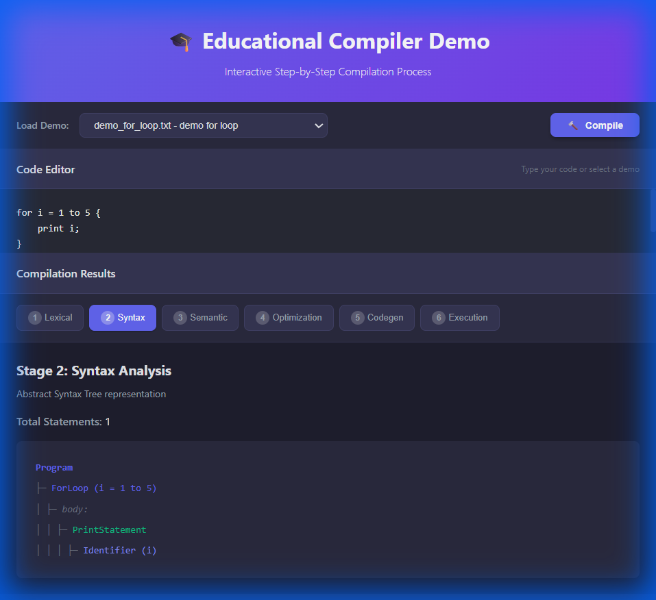
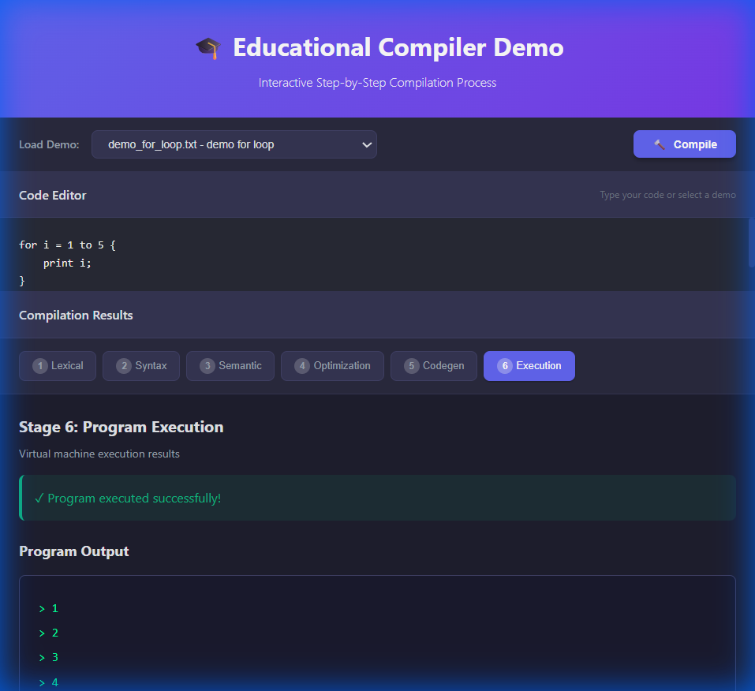

# 🎓 Educational Compiler Project

A complete **6-stage educational compiler** built from scratch in C++ to demonstrate how compilers work. This project takes source code through lexical analysis, parsing, semantic validation, optimization, code generation, and execution on a stack-based virtual machine.

**New!** Now features a modern **Web Interface** for an interactive experience!



## 🌟 Features

- **Web Interface** - Modern, interactive code editor with visualization
- **Complete Pipeline** - Lexer, Parser (AST), Semantic, Optimization, CodeGen, VM
- **Control Flow** - Full support for `if-else` and `for` loops
- **Optimization** - Constant folding and propagation
- **Visualization** - Step-by-step view of every compilation stage
- **Error Detection** - Comprehensive semantic and syntax error handling
- **Demo Library** - 12+ built-in examples

## 🚀 Quick Start

1.  **Build the Backend**:
    ```bash
    g++ -std=c++17 -I. main_web_api.cpp compiler/lexer/Lexer.cpp compiler/parser/AST.cpp compiler/parser/Parser.cpp compiler/semantic/SemanticAnalyzer.cpp compiler/semantic/SymbolTable.cpp compiler/codegen/CodeGenerator.cpp compiler/bytecode/Bytecode.cpp compiler/bytecode/BytecodeProgram.cpp compiler/vm/VirtualMachine.cpp compiler/optimizer/Optimizer.cpp -o compiler_web_api.exe
    ```

2.  **Start the Web Server**:
    ```bash
    cd web-app
    npm install
    npm start
    ```

3.  **Explore**: Open [http://localhost:3000](http://localhost:3000)

## 🔧 Compilation Stages

The web interface visualizes all 6 stages:

1. **Lexical Analysis (Tokens)**: Breaks code into keywords, identifiers, and symbols.
2. **Syntax Analysis (AST)**: Builds the tree structure of the program.
3. **Semantic Analysis**: Checks for logical errors (e.g., using undefined variables).
4. **Code Optimization**: Improves code efficiency (e.g., `2 + 3` becomes `5`).
5. **Code Generation (Bytecode)**: Generates low-level instructions.
6. **Execution**: Runs the code on a stack-based virtual machine.

## 📸 Screenshots

### Abstract Syntax Tree (AST)


### Program Execution


## 📁 Project Structure

```
compiler-project/
├── compiler/           # C++ Backend Source
│   ├── lexer/          # Tokenization
│   ├── parser/         # AST Construction
│   ├── semantic/       # Validation
│   ├── iterate/        # Optimization
│   ├── codegen/        # Bytecode Generation
│   └── vm/             # Virtual Machine
├── web-app/            # Node.js Frontend
│   ├── public/         # UI Assets (HTML/CSS/JS)
│   └── server.js       # Express Server
├── demos/              # Demo Files
└── main_web_api.cpp    # JSON API Interface
```

## 💻 Language Syntax

**Variables & Arithmetic:**
```javascript
let x = 10;
let y = 20;
print x + y;
```

**If-Else Control Flow:**
```javascript
if x > 5 {
    print x;
} else {
    print 0;
}
```

**For Loops:**
```javascript
for i = 1 to 5 {
    print i;
}
```

## 👨‍💻 Author
Built from scratch as an educational demonstration of compiler construction.
